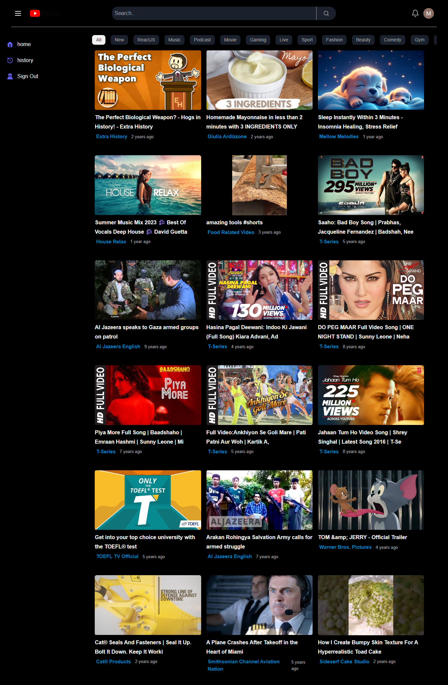

This React-based project utilizes the YouTube API to create a dynamic and engaging user experience for exploring YouTube content. It features infinite scrolling for seamless video discovery, detailed video information and comments, related video suggestions, channel exploration, and recent channel video listings.

**Technologies:**

* **Frontend:** React, React Router DOM v6, Tailwind CSS
* **Data Fetching:** Axios
* **Authentication:** Firebase

**Features:**

* **Infinite Scroll:** Load videos continuously as you scroll, eliminating pagination limitations.
* **Video Details:** Access detailed information about each video, including title, description, view count, like/dislike ratios, channel name, and more.
* **Video Comments:** View and engage with comments left by other users (subject to YouTube's moderation policies).
* **Related Videos:** Discover a wider range of videos based on your current browsing preferences, encouraging content exploration.
* **Channel Information:** Explore the associated channel's details, such as profile picture, banner image, subscriber count, and content creation frequency.
* **Channel Recent Videos:** Browse the channel's latest uploads directly from the video page.

**Screenshots:**



**Getting Started:**

```markdown
1. Clone the repository:

   ```bash
   git clone https://github.com/abdullahMamun01/youtube-clone.git
